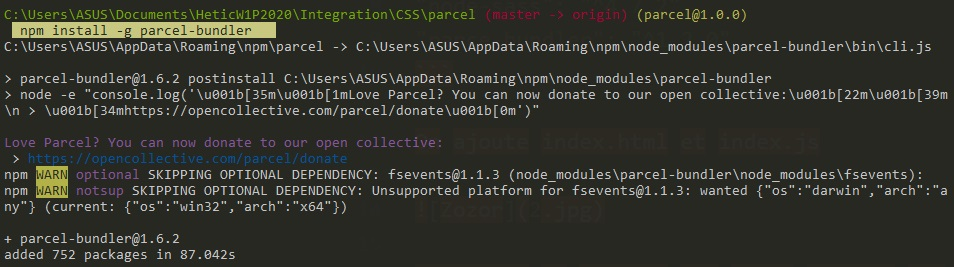

# Utilisation de parcelJs

entrer dans une consolecréer un dossier diriger vous dedans, la commance `npm init` et donnez lui un nom si nécessaire (cf screen ci-dessous )


Dans json crée on rajoute ces éléments pour configurer les versions de node-sass et parce-bundler

```json
"dependencies": {
"node-sass": "^4.7.2",
"parce-bundler": "^1.2.0"
}
```

On ajoute `index.html` et `index.js`


installer un package sur notre machine (en parcel)
entrer `npm install -g parcel-bundler`



Mettre à jour son parcel-bundler sur json (en `1.6.2` à la place du 1.2.0) puis entrer la commande `npm install` et voila le résultat


Et pour finir faire un `npm run start` pour lancer le npm et voila fini


---------------------------------

# Utilisation du scss

 ## créer votre dossier css / style

 

**Ce dossier contiendra votre fichier `style.scss`**

## Importer votre style dans le js
Une fois que vous avez préalablement ajouter un *style quelconque* dans votre fichier **style.scss**,
ouvrer votre **fichier js** et importer votre style scss comme indiqué ci-dessous;

```javascript
  import './style/style.scss';
```
[Pour en savoir plus ...](https://parceljs.org/getting_started.html)
